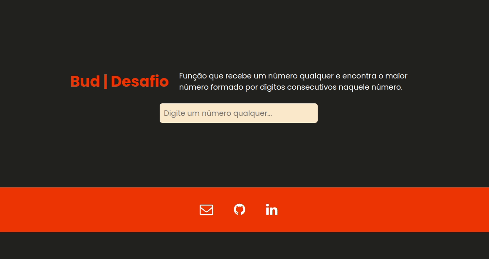

# Bud | Processo seletivo

 
 

  

## Tecnologias utilizadas:

 

 
 
 

## Descrição:

 
Função que recebe um número qualquer e encontra o maior 
    número formado por dígitos consecutivos naquele número.

 
 
 
<h1 align="center">
  
</h1>

## License

[MIT licensed](LICENSE).
